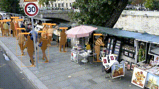

# Crowd Person Detection (Video)

Детектирование людей и отображение их сегментационных масок на видео (`crowd.mp4`) с использованием Python и Ultralytics YOLO или YOLO + SAM.
Создаёт выходное видео с наложенными рамками/масками, именами классов и уровнями достоверности. Видео в полном масштабе и качестве можно найти в этом репозитории по пути **output/out.mp4**.




## Quickstart

```bash
# 1) Create & activate conda env (recommended)
conda env create -f environment.yml
conda activate crowddet

# 2) Run (YOLO)
python -m src.main --video input/crowd.mp4 --out output/out.mp4 --use_masks --model yolo11s-seg.pt --device cpu
# or boxes only:
python -m src.main --video input/crowd.mp4 --out output/out.mp4 --model yolo11s.pt --device cpu

# Run (YOLO + SAM)

# download SAM weights
curl -L -o weights/sam_vit_b_01ec64.pth https://dl.fbaipublicfiles.com/segment_anything/sam_vit_b_01ec64.pth

# run
python -m src.main --video input/crowd.mp4 --out output/out_sam.mp4 --model yolo11s.pt --device cpu --use_masks --sam_refine --sam_checkpoint weights/sam_vit_b_01ec64.pth --sam_model vit_b
```

> Веса `yolo11s(-seg).pt` подгружаются при первом запуске.
> cpu поддерживается, gpu будет использоваться автоматически, если доступен.
## Repo Layout
```
.
├── README.md
├──environment.yml
├── input
    ├── crowd.mp4
├── output
    ├── out.mp4
    ├── output_video.gif
└── src
    ├── main.py          # entry point
    ├── detector.py      # YOLO wrapper
    ├── visualize.py     # drawing utilities (boxes & masks)
    └── video_io.py      # video reader/writer helpers
```

## Notes
- Фильтр класса по умолчанию — только для людей (COCO id 0).
- FPS и разрешение выходных данных по умолчанию соответствуют входным.
- Для длинных видео можно использовать --stride N для выборки каждого N-го кадра для инференса.

## Report / Analysis
**Наблюдения**: 

Вариант с YOLO:
- недосегментация частей (руки/кисти иногда не входят в маску);
- границы сегментационных масок местами нечёткие — это ожидаемо для масок с апскейла детекторных голов.
- замечено ложное срабатывание, модель распознала отдельно стоящий рюкзак человеком с вероятностью 0.52, так же ложное срабатывание на изображение девушки на картине;
- присутствуют пропуски обнаружения в местах массового скопления людей;
- человек, перекрытый другим объектом или человеком в какой то момент видео, перестаёт детектироваться на несколько кадров;


Вариант YOLO + SAM:
- решены проблемы, связанные с сегментацией, наблюдаемые при использовании только yolo11n-seg.pt. Маски стали иметь более четкие и правильные очертания и не захватывают лишних пикселей;
- проблемы пропусков в детекции или ложных срабатываний остаются.

---

## Improvement Plan

1. Сейчас для запуска на CPU используется `yolo11s(-seg)` для скорости, однако можно попробовать `yolo11m(-seg)` или `yolo11l(-seg)` для улучшения качества.


2. Для борьбы с отсутствием сегментационных масок на перекрытых другими объектами людях можно добавить трекер (например, ByteTrack / OC‑SORT), это также может быть полезно для стабилизации IDs.

3. **Реализовано.** Маски SAM: детектор отдаёт bbox, SAM уточняет границы, это даст более острые и точные края на сложных контурах, однако эта модель намного больше и архитектурно сложнее yolo11s-seg, поэтому такая обработка видео будет занимать в десятки раз больше времени.

4. **Fine-tuning**
- Небольшая тонкая настройка нескольких аннотированных кадров из данного видео.
- Дообучение модели на специализированных датасетах, с большим количеством кадров массового скопления людей, условиями видимости, освещённостью аналогичными условиям на целевом видео.


